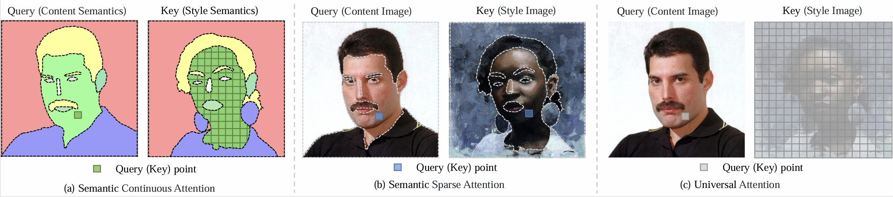
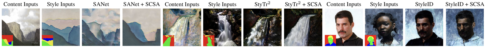

# SCSA (CVPR 2025 Highlight)

Official Pytorch code for ["SCSA: A Plug-and-Play Semantic Continuous-Sparse Attention for Arbitrary Semantic Style Transfer"](https://arxiv.org/abs/2503.04119).

## Introduction:

**SCSA** is a novel plug-and-play Semantic Continuous-Sparse Attention that can be seamlessly integrated into attention-based arbitrary style transfer methods (CNN-based, Transformer-based, and Diffusion-based approaches) for arbitrary semantic style transfer. 

SCSA consists of two parts: (a) Semantic Continuous Attention (**SCA**): The query point of the *content semantic map features* can match all continuous key points of the *style semantic map features* in the same semantic region. Therefore, SCA can fully account for the overall stylistic characteristics; (b) Semantic Sparse Attention (**SSA**): The query point of the *content image features* can match the most similar sparse key point of the *style image features* in the same semantic region. Hence, SSA can intently concentrate on the specific stylistic texture of regions with the same semantics. 

SCSA not only enables attention-based arbitrary style transfer methods to achieve semantic style transfer but also preserves and even enhances the original stylization.

## Environment:
- Python 3.8
- Pytorch 2.4.1

## Getting Started:
**Clone this repo:**

`git clone https://github.com/scn-00/SCSA`  
`cd SCSA`  
`python sem.py`

**SANet + SCSA:**

- Move into the target folder.

  `cd SANet+SCSA`  

- Prepare the same pre-trained models from [SANet](https://github.com/GlebSBrykin/SANET). Unzip and place them at path `models/`.
- Test a pair of images using SANet:

  `python SANet.py --content ../sem_data/29/29.jpg --style ../sem_data/29/29_paint.jpg`   

- Test a pair of images using SANet + SCSA:

  `python SCSA.py --content ../sem_data/29/29.jpg --style ../sem_data/29/29_paint.jpg --content_sem ../sem_data/29/29_sem.png --style_sem ../sem_data/29/29_paint_sem.png --sem_map_64 ../sem_precomputed_feats/29/29_29_paint_map_64.pt --sem_map_32 ../sem_precomputed_feats/29/29_29_paint_map_32.pt`
  
- Test the collections of images using SANet and SANet + SCSA:

  `python run.py`

**StyTr$^2$ + SCSA:**

- Move into the target folder.

  `cd StyTr2+SCSA`  

- Prepare the same pre-trained models from [StyTr$^2$](https://github.com/diyiiyiii/StyTR-2). Unzip and place them at path `experiments/`.

- Test a pair of images using StyTr$^2$:

  `python StyTr2.py --content ../sem_data/31/31_paint.jpg --style ../sem_data/31/31.jpg`   

- Test a pair of images using StyTr$^2$ + SCSA:

  `python SCSA.py --content ../sem_data/31/31_paint.jpg --style ../sem_data/31/31.jpg --content_sem ../sem_data/31/31_paint_sem.png --style_sem ../sem_data/31/31_sem.png --sem_map_64 ../sem_precomputed_feats/31/31_paint_31_map_64.pt --sem_map_32 ../sem_precomputed_feats/31/31_paint_31_map_32.pt`
  
- Test the collections of images using StyTr$^2$ and StyTr$^2$ + SCSA:

  `python run.py`

**StyleID + SCSA:**

- Move into the target folder.

  `cd StyleID+SCSA`  

- Prepare the same pre-trained models from [StyleID](https://github.com/jiwoogit/StyleID). Unzip and place them at path `models/`.

- Test a pair of images using StyleID:

  `cd StyleID`

  `python StyleID.py --cnt ../sem_data/1/1.jpg --sty ../sem_data/1/1_paint.jpg`   

- Test a pair of images using StyleID + SCSA:

  `cd StyleID+SCSA`

  `python run.py --cnt ../../sem_data/1/1.jpg --sty ../../sem_data/1/1_paint.jpg --cnt_sem ../../sem_data/1/1_sem.png --sty_sem ../../sem_data/1/1_paint_sem.png --sem_map_32 ../../sem_precomputed_feats/1/1_1_paint_map_32.pt --sem_map_64 ../../sem_precomputed_feats/1/1_1_paint_map_64.pt`

- Test the collections of images using StyleID and StyleID + SCSA:

  `python run.py`

## Acknowledgements:
We conduct experiments with [SANet](https://github.com/GlebSBrykin/SANET), [StyTr$^2$](https://github.com/diyiiyiii/StyTR-2), and [StyleID](https://github.com/jiwoogit/StyleID). Great thanks to them!

